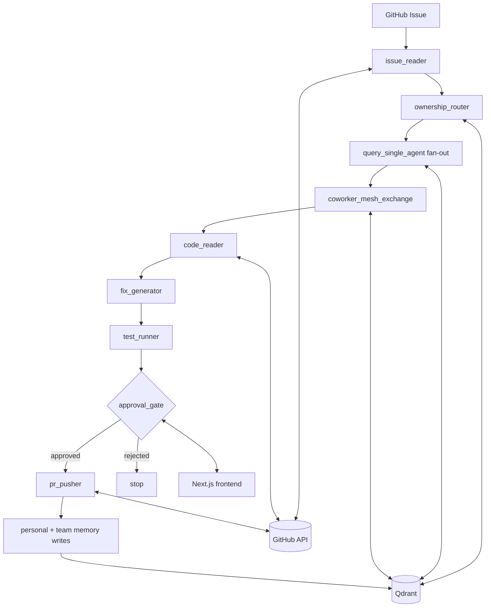
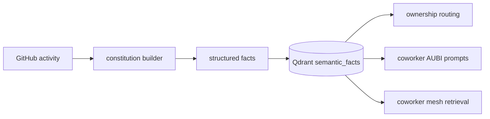
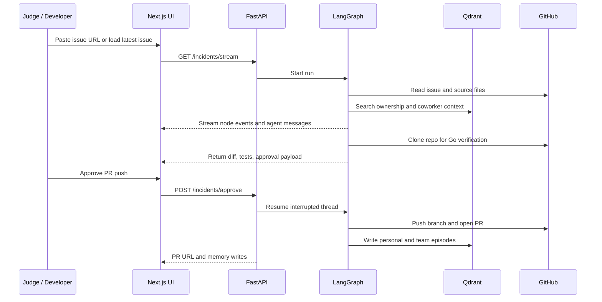

<div align="center">


### AI coworkers with team memory, ownership routing, and human-approved PRs.

**AUBI** turns a GitHub issue into a context-aware fix proposal by asking the right developer-shaped AI coworker first.

GDSC Hackathon 2026 - University of Maryland

</div>

---

## Why AUBI Exists

Most AI developer tools are optimized for one question:

> "Can an agent write a patch?"

In real teams, the slower question is usually:

> "Who understands why this broke, what tradeoffs already exist, and what context should not be forgotten?"

AUBI is built around that missing layer. It creates persistent **Context Constitutions** for developers from GitHub activity, stores them in Qdrant, routes issues to the most relevant coworker AUBIs, lets nearby coworker agents share context, generates a patch from the live repository, runs verification, and stops at a human approval gate before opening a GitHub PR.

The goal is developer productivity through **better context selection**, not blind automation.

---

## What It Does

| Capability | How AUBI handles it |
|---|---|
| Developer memory | Stores structured facts about ownership, expertise, collaboration style, current focus, known issues, and resolved episodes. |
| Issue triage | Reads a GitHub issue, extracts affected files, service, error type, and urgency. |
| Ownership routing | Uses Qdrant semantic search plus filepath ownership signals to select the right coworker AUBI. |
| Coworker mesh | Owner agents can ask related coworker AUBIs for adjacent context from personal and shared team memory. |
| Patch generation | Reads live source files from GitHub and generates a complete replacement file plus unified diff. |
| Verification | For Go fixes, clones the repo, applies the generated file, and runs `go test ./...`. |
| Human approval | LangGraph pauses at an approval interrupt; the frontend can approve or reject before PR creation. |
| PR creation | On approval and passing tests, pushes a branch and opens a GitHub PR with issue linkage. |
| Learning loop | Writes personal and team-scoped incident episodes back into Qdrant after PR creation. |

---

## Demo Flow

1. Open the **Team** view to show coworker AUBIs and their Context Constitutions.
2. Open the **Incident** view and load the latest configured GitHub issue or paste `owner/repo#123`.
3. AUBI streams the graph in real time: issue reader, ownership router, agent consults, coworker mesh, code reader, fix generator, test runner, approval gate.
4. Judges see why a developer was selected, what coworker context was exchanged, what patch was generated, and whether tests passed.
5. A human clicks **Approve PR Push**.
6. AUBI opens the GitHub PR and writes the resolved episode back into personal and team memory.

The strongest demo moment is not the patch. It is the visible chain from **issue -> owner evidence -> coworker context -> verified diff -> approval -> memory update**.

---

## Architecture



### Backend Graph

The backend is a FastAPI app with a LangGraph state machine:

| Node | Responsibility |
|---|---|
| `issue_reader` | Reads a GitHub issue or incident input and extracts affected files and incident metadata. |
| `ownership_router` | Searches Qdrant for code ownership facts and selects owner agent IDs. |
| `query_single_agent` | Fans out to each owner AUBI and asks what their constitution knows. |
| `coworker_mesh_exchange` | Finds related coworkers using semantic memory, known issues, current focus, expertise, and shared team history. |
| `code_reader` | Fetches relevant files from GitHub. |
| `fix_generator` | Produces complete fixed file content, diff, and explanation. |
| `test_runner` | Applies the generated Go file in a temp checkout and runs `go test ./...`. |
| `approval_gate` | Uses a LangGraph interrupt to pause for human approval. |
| `pr_pusher` | Creates the branch, commits the fix, opens the PR, and writes memory episodes. |

The graph streams events over Server-Sent Events so the frontend can render node progress, agent messages, routing evidence, coworker exchanges, patch output, test results, and memory writes.

---

## Memory Model

AUBI's memory design is inspired by:

| Influence | What AUBI borrows conceptually |
|---|---|
| Letta / MemGPT | Long-lived agent memory that survives a single chat or task. |
| OpenAgents-style coworker systems | Multiple task-specific AI coworkers coordinating instead of one monolithic assistant. |
| Qdrant vector memory | Semantic retrieval over structured facts and resolved episodes. |

This repo does not import Letta, MemGPT, or OpenAgents as runtime dependencies. The implementation is an AUBI-native memory layer backed by Qdrant.

### Context Constitution

Each coworker AUBI has a Context Constitution: structured facts inferred from GitHub activity and stored as semantic triples.



| Category | Example meaning |
|---|---|
| `code_ownership` | Directories, files, and services the developer appears to own. |
| `expertise` | Languages, frameworks, and domains inferred from work patterns. |
| `collaboration` | Review and communication preferences used when drafting context and PR text. |
| `current_focus` | Recent areas of activity. |
| `known_issues` | Risks or recurring problems tied to the developer's area. |
| `episodes` | Resolved incidents written after approved PRs. |

The store supports both **user-scoped memory** and **team-scoped memory**. Personal memory helps route to the right coworker; team memory helps related AUBIs share prior incidents and resolutions.

---

## Issue-to-PR Flow



---

## Tech Stack

| Layer | Tech |
|---|---|
| Frontend | Next.js 14, React 18, TypeScript, Tailwind CSS, Framer Motion |
| Backend | FastAPI, Python 3.11, LangGraph, LangChain OpenAI |
| Memory | Qdrant, `sentence-transformers` with `all-MiniLM-L6-v2` embeddings |
| GitHub | PyGithub for issue reads, file reads, branch commits, and PR creation |
| Streaming | Server-Sent Events from FastAPI, proxied through Next.js route handlers |
| Deployment | Railway backend via `backend/Dockerfile`, Vercel frontend via `vercel.json` |

### Model Configuration

The current code uses OpenAI-compatible chat models configured by environment variables:

| Variable | Used for |
|---|---|
| `OPENAI_MODEL` | Graph reasoning, issue parsing, agent responses, fix generation, and PR body generation. |
| `OPENAI_CONSTITUTION_MODEL` | Optional override for constitution extraction. Falls back to `OPENAI_MODEL`. |
| `OPENAI_BASE_URL` | Optional OpenAI-compatible base URL. |

The hackathon design in `plans/PLAN_3.0.md` calls out Gemini structured output for constitution building. In the checked-in implementation, constitution extraction is currently wired through the OpenAI-compatible JSON response path in `backend/constitution/builder.py`.

---

## Repository Map

```text
backend/
  main.py                         FastAPI app, REST endpoints, SSE stream, approval resume
  graphs/
    incident_graph.py             LangGraph issue-to-PR pipeline
    state.py                      Shared graph state schema
  constitution/
    builder.py                    GitHub profile data -> constitution facts
    store.py                      Qdrant facts, episodes, ownership, team memory
  ingestion/
    github_ingest.py              Developer profile ingestion from GitHub
    github_issue.py               Issue read, repo file read, PR creation

frontend/
  src/app/page.tsx                Landing/product overview
  src/app/team/page.tsx           Coworker mesh and constitution viewer
  src/app/incident/page.tsx       Judge-facing issue-to-PR workflow
  src/app/demo/page.tsx           Stream-focused AUBI flow view
  src/app/api/*                   Next.js proxy routes to the backend
  src/hooks/useIncidentStream.ts  SSE stream + approval integration
```

---

## Setup

### Prerequisites

- Python 3.11
- Node.js 18+
- Git
- Go, if you want the `go test ./...` verification gate to pass
- A GitHub token with access to the target repository
- A Qdrant instance, local or cloud
- An OpenAI-compatible API key/model

### 1. Backend Environment

```bash
cd backend
cp .env.example .env
```

Fill in:

```bash
OPENAI_API_KEY=...
OPENAI_MODEL=...
OPENAI_CONSTITUTION_MODEL=...
OPENAI_BASE_URL=...

GITHUB_TOKEN=...
TARGET_REPO=owner/repo
TARGET_REPOS=owner/repo

AUBI_TENANT_ID=hackathon
AUBI_TEAM_ID=default

QDRANT_URL=http://localhost:6333
QDRANT_API_KEY=
```

For local Qdrant:

```bash
docker run -p 6333:6333 qdrant/qdrant
```

### 2. Run Backend

```bash
cd backend
python -m venv .venv
source .venv/bin/activate
pip install -r requirements.txt
uvicorn main:app --reload --port 8000
```

Check readiness:

```bash
curl http://localhost:8000/ready
```

### 3. Frontend Environment

```bash
cd frontend
cp .env.example .env.local
```

Set:

```bash
NEXT_PUBLIC_BACKEND_URL=http://localhost:8000
BACKEND_URL=http://localhost:8000
```

### 4. Run Frontend

```bash
cd frontend
npm install
npm run dev
```

Open:

- `http://localhost:3000/team` for coworker constitutions
- `http://localhost:3000/incident` for the full issue-to-PR flow
- `http://localhost:3000/demo` for the stream-focused flow view

---

## API Quick Reference

| Endpoint | Purpose |
|---|---|
| `POST /agents` | Create a coworker AUBI from a GitHub username and persist its constitution. |
| `GET /agents` | List coworker AUBIs from in-memory registry and Qdrant. |
| `GET /agents/{agent_id}` | Fetch one coworker and its constitution. |
| `GET /constitution/{agent_id}` | Fetch grouped constitution facts. |
| `GET /constitution/team` | Query or list shared team memory. |
| `POST /constitution/team` | Write a shared team fact or episode. |
| `GET /ownership?filepath=...` | Resolve likely owner for a file path. |
| `GET /github/poll` | Fetch latest open issue from `TARGET_REPO`. |
| `POST /incidents/run` | Run the graph as a blocking request; pauses at approval unless auto-approved. |
| `GET /incidents/stream` | Run the graph and stream SSE events. |
| `POST /incidents/approve` | Resume a paused LangGraph thread and approve or reject PR creation. |
| `GET /ready` | Verify required demo dependencies and service configuration. |

---

## Deployment

### Backend on Railway

The repo includes `railway.toml` and `backend/Dockerfile`.

Railway runs:

```bash
uvicorn main:app --host 0.0.0.0 --port ${PORT:-8000} --workers 1
```

Set the same backend environment variables in Railway. Use one worker for the hackathon demo because the in-memory LangGraph checkpointer must preserve interrupted approval threads inside the running process.

### Frontend on Vercel

`vercel.json` points Vercel at the `frontend` directory.

Set:

```bash
NEXT_PUBLIC_BACKEND_URL=https://your-railway-backend
BACKEND_URL=https://your-railway-backend
```

---

## Judging Highlights

| Highlight | Why it matters |
|---|---|
| Context before code | AUBI demonstrates that the best patch starts with the right team memory, not just repository search. |
| Explainable routing | The UI can show why a coworker was chosen through ownership facts, confidence, and evidence. |
| Coworker AUBIs | The system models multiple developer representatives that exchange context before code generation. |
| Persistent memory | Resolved incidents become future retrieval context through Qdrant user and team episodes. |
| Human control | The graph cannot open a PR until the approval gate is resumed. |
| Real integration path | GitHub issues, GitHub file reads, GitHub PR creation, SSE streaming, Railway backend, and Vercel frontend are all represented in the repo. |

---

## Honest Scope

AUBI is a hackathon prototype, not a production incident platform. The current implementation is strongest for the GitHub issue-to-PR demo path, especially Go repositories where `go test ./...` can verify the generated file. The memory model, approval interrupt, Qdrant retrieval, GitHub PR creation, and frontend streaming path are implemented; broader language test runners, deeper sandboxing, reviewer assignment automation, and production-grade multi-worker persistence are natural next steps.

---

<div align="center">

Built for the GDSC Hackathon 2026 at the University of Maryland.

AI that knows the team, not just the codebase.

</div>
