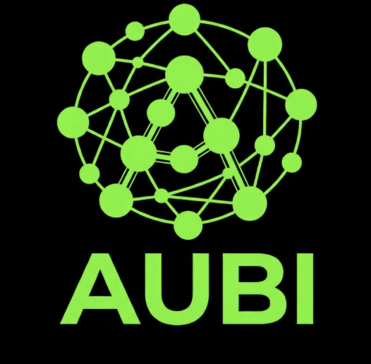
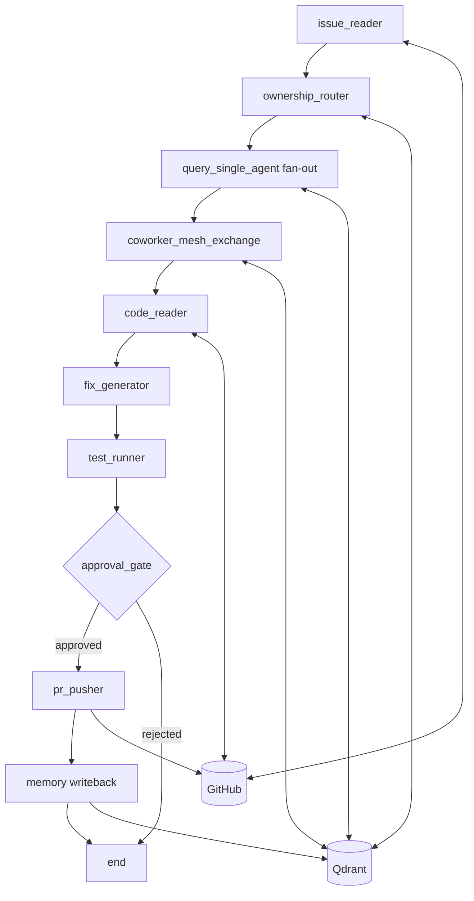
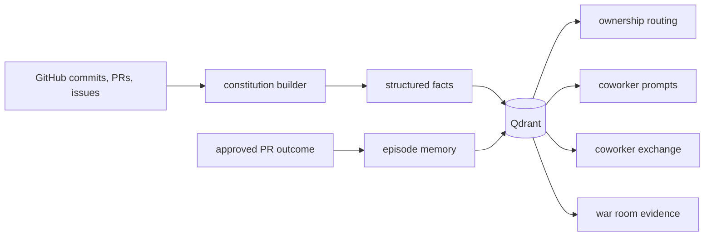
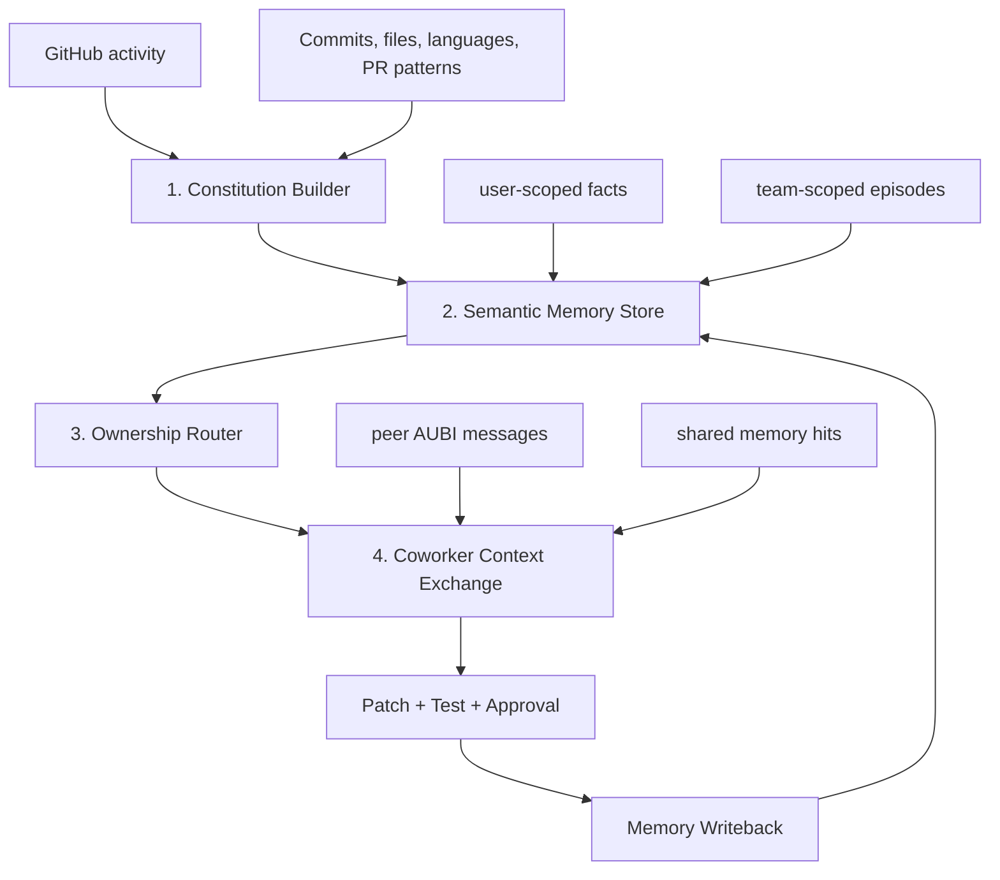
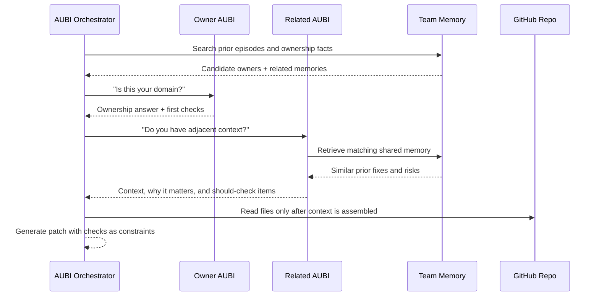
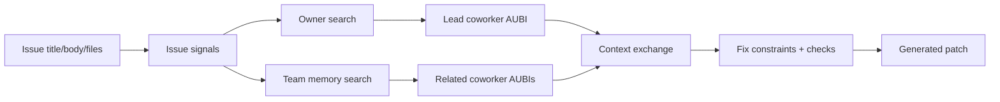
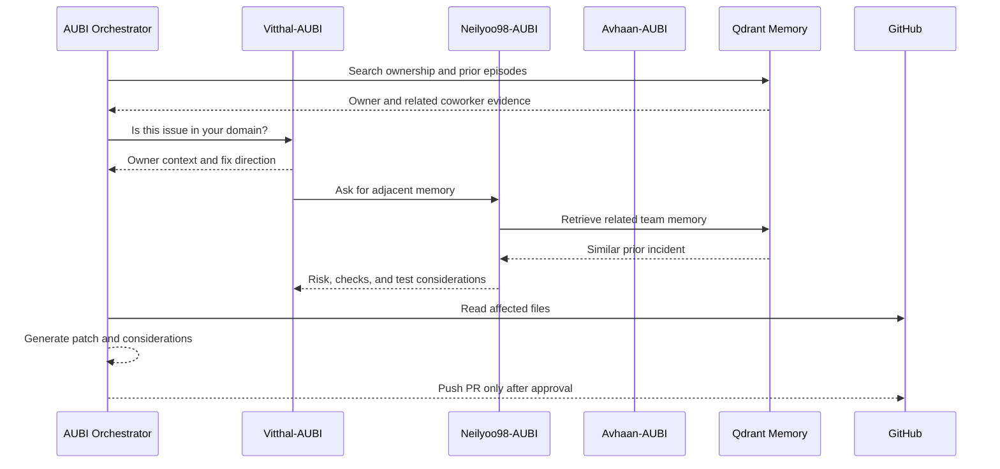

<div align="center">



# AUBI

### Autonomous Understanding and Behaviour Inference

**Persistent AI coworkers that understand who owns what, share team memory, and turn GitHub issues into human-approved pull requests.**

GDSC Hackathon 2026 - University of Maryland

</div>

---

## The Idea

Most coding agents start by asking, "What code should I edit?"

AUBI starts one level earlier:

> "Which teammate's context matters here, what has the team already learned, and which AI coworker should handle the fix?"

AUBI gives each developer a persistent AI coworker backed by a **Context Constitution**: structured memory about ownership, expertise, collaboration style, current focus, known issues, and resolved incidents. When a GitHub issue arrives, AUBI routes it to the right coworker, lets related coworkers exchange context, reads live repository files, generates a patch, runs verification, pauses for human approval, opens a PR, and writes the outcome back into memory.

The result is not just an autonomous patch. It is an explainable, team-aware issue-to-PR workflow.

---

## What Judges Should Notice

| Signal | Why it is impressive |
|---|---|
| **Developer-shaped coworkers** | The system represents Vitthal-AUBI, Avhaan-AUBI, Neilyoo98-AUBI, and Mitanshcodes-AUBI as persistent coworkers instead of generic bots. |
| **Context before code** | AUBI explains who owns the issue, why they were selected, and what related coworkers contributed before generating a fix. |
| **Live coworker mesh** | The UI shows AUBIs exchanging context, retrieving shared memory, and flagging considerations that affect the generated patch. |
| **Real repository integration** | Issues, file reads, verification, branches, and PR creation are wired to GitHub instead of being a static mock. |
| **Human approval gate** | AUBI stops before pushing a PR and waits for explicit approval. |
| **Learning loop** | Approved work becomes future user and team memory in Qdrant. |

---

## Demo Script

1. Open **Team** to show each coworker's Context Constitution.
2. Open **Coworkers** to show the mesh of developer AUBIs and their ownership relationships.
3. Open **Flow**, choose a live issue from `Neilyoo98/AUBI-demo`, and run AUBI.
4. Watch the issue move through routing, coworker exchange, code read, fix generation, tests, and approval.
5. Click **Approve PR Push**.
6. Open **War Room** to explain why the routing happened, which memory was used, which considerations were handled, and what got written back.

The strongest moment is the chain:

```text
GitHub issue -> owner evidence -> coworker context -> generated diff -> verification -> approval -> PR -> memory update
```

---

## Product Surface

| Page | Purpose |
|---|---|
| **Team** | Card-based view of each AUBI coworker's constitution: expertise, ownership, style, memory age, and fact count. |
| **Coworkers** | Relationship graph showing how AUBI coworkers connect through ownership, expertise, collaboration, current focus, and known issues. |
| **Flow** | Operator view for running an issue-to-PR workflow with progress, diff, approval state, PR preview, and live agent messages. |
| **War Room** | Explanation layer: live context exchange, shared memory hits, considerations, coworker map, and reasoning trace for the same run. |

---

## Architecture

```mermaid
flowchart LR
    subgraph UI["Next.js Frontend"]
        team["Team"]
        coworkers["Coworkers"]
        flow["Flow"]
        warroom["War Room"]
        proxy["API proxy routes"]
    end

    subgraph API["FastAPI Backend"]
        agents["Agent registry"]
        graph["LangGraph incident graph"]
        ingest["GitHub ingestion"]
        sse["SSE event stream"]
    end

    subgraph Memory["Qdrant Memory"]
        facts["semantic_facts"]
        episodes["episodes"]
        teamMemory["team-scoped memory"]
    end

    subgraph GitHub["GitHub"]
        issues["Issues"]
        files["Repository files"]
        branch["Fix branch"]
        pr["Pull request"]
    end

    team --> proxy
    coworkers --> proxy
    flow --> proxy
    warroom --> proxy
    proxy --> agents
    proxy --> graph
    graph --> sse
    sse --> flow
    sse --> warroom
    agents --> ingest
    ingest --> GitHub
    ingest --> Memory
    graph <--> Memory
    graph <--> issues
    graph <--> files
    graph --> branch
    graph --> pr
```

---

## Issue-to-PR Graph

The backend uses LangGraph to model a real workflow with state, fan-out, streaming events, and an approval interrupt.



| Node | What it does |
|---|---|
| `issue_reader` | Reads the issue or pasted incident and extracts title, body, service, error type, and likely affected files. |
| `ownership_router` | Searches Qdrant and file-path evidence to select likely owner coworkers. |
| `query_single_agent` | Fans out to owner AUBIs and asks what their constitution knows. |
| `coworker_mesh_exchange` | Selects adjacent coworkers using ownership, expertise, current focus, known issues, collaboration, and shared-memory overlap. |
| `code_reader` | Resolves missing paths and reads live source files from GitHub. |
| `fix_generator` | Uses the issue, owner context, coworker context, memory, and source files to produce a patch. |
| `test_runner` | Applies generated files in a temporary checkout and runs verification, including `go test ./...` for Go repos. |
| `approval_gate` | Pauses the graph with a LangGraph interrupt until the UI approves or rejects. |
| `pr_pusher` | Pushes a branch, opens a PR, links the issue, and writes resolved episodes back to memory. |

---

## Context Constitution

Every AUBI coworker is backed by structured memory derived from GitHub activity and incident outcomes.



| Memory block | Example use |
|---|---|
| `code_ownership` | "Vitthal-AUBI owns auth/token.go and auth-related backend work." |
| `expertise` | "Avhaan-AUBI is strong in frontend, TypeScript, and UI implementation." |
| `collaboration` | "This coworker tends to validate changes through tests before PRs." |
| `current_focus` | "Recent commits show active work in frontend routes and dashboard components." |
| `known_issues` | "Prior auth token cache bugs involved concurrent map access." |
| `episodes` | "Issue #1 was fixed by guarding TokenCache and verifying Go tests." |

Memory is stored in two Qdrant collections:

| Collection | Scope | Purpose |
|---|---|---|
| `semantic_facts` | User and team | Ownership, expertise, collaboration, current focus, known issues. |
| `episodes` | User and team | Resolved incidents and PR outcomes that should influence future runs. |

---

## The Context Layer We Built

AUBI's main technical layer is the bridge between individual developer memory and a shared coworker network.

It is made of four parts:



| Layer | What it owns |
|---|---|
| **Constitution Builder** | Converts GitHub activity into stable facts about a developer's ownership, expertise, current focus, collaboration style, and known issues. |
| **Semantic Memory Store** | Stores those facts and incident episodes in Qdrant with tenant, team, user, scope, category, and predicate metadata. |
| **Ownership Router** | Combines affected files, issue text, semantic search, and profile facts to pick the coworker AUBI that should lead. |
| **Coworker Context Exchange** | Selects adjacent AUBIs and asks them for relevant context before code generation. |
| **Memory Writeback** | Turns approved PR outcomes into future user and team episodes. |

### Constitution Fact Shape

Each memory item is stored as a structured semantic fact:

```json
{
  "subject": "Vitthal-Agarwal",
  "predicate": "owns",
  "object": "auth/ directory and auth/token.go in Neilyoo98/AUBI-demo",
  "category": "code_ownership",
  "confidence": 0.92
}
```

The backend adds operational metadata before writing to Qdrant:

| Field | Why it matters |
|---|---|
| `tenant_id` | Keeps hackathon/demo memory isolated. |
| `scope` | Separates `user` memory from `team` memory. |
| `scope_id` | Enables filtered retrieval for a specific coworker or shared team. |
| `category` | Lets the router favor ownership, expertise, current focus, known issues, and collaboration facts differently. |
| `predicate` | Makes facts queryable as human-readable relationships instead of opaque chunks. |

### Coworker Communication Protocol

When an issue starts, AUBI does not simply retrieve top-k chunks and write code. It runs a small communication protocol:



Each coworker exchange carries:

| Payload | Used by |
|---|---|
| `requester` and `responder` | War Room and Flow visualizations. |
| `reason` | Explains why that coworker was consulted. |
| `selection_signals` | Shows whether the match came from ownership, expertise, current focus, known issues, collaboration, or shared-memory overlap. |
| `context_shared` | Feeds the fix generator and War Room explanation. |
| `should_check` | Becomes the visible considerations checklist against the generated patch. |
| `shared_memory_hits` | Proves the answer came from persistent team memory, not just the current prompt. |

This is the layer that makes AUBI feel like a team of persistent coworkers instead of one stateless coding assistant.

### Retrieval Path



The frontend exposes this path in two ways:

| View | What it proves |
|---|---|
| **Flow** | The operational state: progress, patch, tests, approval, and PR readiness. |
| **War Room** | The reasoning state: human signal, owner routing, coworker exchange, memory impact, considerations, and live trace. |

---

## Coworker Mesh

AUBI does not use a single central bot to hallucinate context. It routes through coworker AUBIs.



The War Room makes this visible. It shows:

- Which AUBI asked which coworker for context.
- Why that coworker was selected.
- Which shared memory was used.
- Which considerations were addressed by the generated fix.
- What got written back after the run.

---

## Tech Stack

| Layer | Technology |
|---|---|
| Frontend | Next.js 14, React 18, TypeScript, Tailwind CSS, Framer Motion |
| Backend | FastAPI, Python, LangGraph, LangChain OpenAI |
| Memory | Qdrant Cloud or local Qdrant |
| Embeddings | Sentence Transformers `all-MiniLM-L6-v2` for local 384-d vectors |
| LLM | OpenAI-compatible chat model configured with `OPENAI_MODEL` |
| GitHub | PyGithub plus Git CLI for issue reads, source reads, branch creation, and PRs |
| Streaming | Server-Sent Events from FastAPI to Next.js |
| Deployment | Railway backend, Vercel frontend |

---

## Repository Map

```text
backend/
  main.py                         FastAPI app, API routes, SSE stream, approval resume
  graphs/
    incident_graph.py             LangGraph issue-to-PR workflow
    state.py                      Graph state schema
    sse_events.py                 Event mapping for the frontend
    prompt_builder.py             Context-aware prompt assembly
  constitution/
    builder.py                    GitHub profile data -> Context Constitution facts
    store.py                      Qdrant semantic facts, episodes, team memory
  ingestion/
    github_ingest.py              Developer profile ingestion from GitHub
    github_issue.py               Issue reads, file reads, PR creation

frontend/
  src/app/team/page.tsx           Team constitution cards
  src/app/agents/page.tsx         Coworker mesh visualization
  src/app/demo/page.tsx           Flow page
  src/app/incident/page.tsx       War Room explanation page
  src/components/aubi/*           AUBI-specific panels and visualizations
  src/hooks/useIncidentStream.ts  SSE run state and approval integration
  src/lib/api.ts                  Frontend API client
  src/lib/warRoomState.ts         Shared run snapshot between Flow and War Room
```

---

## API Surface

| Endpoint | Purpose |
|---|---|
| `POST /agents` | Create an AUBI coworker from a GitHub username and persist its constitution. |
| `GET /agents` | List coworker AUBIs from memory and Qdrant. |
| `GET /agents/{agent_id}` | Fetch one coworker and its constitution. |
| `DELETE /agents/{agent_id}` | Delete a coworker and associated constitution records. |
| `POST /agents/{agent_id}/query` | Ask a coworker's constitution about an incident. |
| `GET /constitution/{agent_id}` | Fetch grouped constitution facts. |
| `PATCH /constitution/{agent_id}` | Add or update a constitution fact. |
| `GET /constitution/team` | Query shared team memory. |
| `POST /constitution/team` | Write shared team facts or episodes. |
| `GET /ownership?filepath=...` | Resolve likely owner for a path. |
| `GET /github/poll` | Fetch latest open issue from `TARGET_REPO`. |
| `GET /github/issues` | List open issues for the target repo. |
| `POST /incidents/run` | Run the graph as a blocking request. |
| `GET /incidents/stream` | Run the graph and stream SSE events. |
| `POST /incidents/approve` | Resume a paused graph and approve or reject PR creation. |
| `GET /health` | Basic health check. |
| `GET /ready` | Configuration and dependency readiness check. |

---

## Local Setup

### 1. Backend

```bash
cd backend
python -m venv .venv
source .venv/bin/activate
pip install -r requirements.txt
cp .env.example .env
```

Fill in:

```bash
OPENAI_API_KEY=...
OPENAI_BASE_URL=https://us.api.openai.com/v1
OPENAI_MODEL=gpt-5.5
OPENAI_CONSTITUTION_MODEL=gpt-5.4-mini

GITHUB_TOKEN=...
TARGET_REPO=Neilyoo98/AUBI-demo
TARGET_REPOS=Neilyoo98/AUBI-demo,Neilyoo98/GDSC-Hackathon

AUBI_TENANT_ID=hackathon
AUBI_TEAM_ID=default

QDRANT_URL=https://your-qdrant-cloud-url
QDRANT_API_KEY=...
```

Run:

```bash
uvicorn main:app --reload --port 8000
```

Check:

```bash
curl http://localhost:8000/ready
```

### 2. Frontend

```bash
cd frontend
npm install
cp .env.example .env.local
```

Set:

```bash
NEXT_PUBLIC_BACKEND_URL=http://localhost:8000
BACKEND_URL=http://localhost:8000
```

Run:

```bash
npm run dev
```

Open:

- `http://localhost:3000/team`
- `http://localhost:3000/agents`
- `http://localhost:3000/demo`
- `http://localhost:3000/incident`

---

## Deployment

### Railway Backend

The backend is deployed from the root using `railway.toml` and `backend/Dockerfile`.

```toml
[build]
dockerfilePath = "backend/Dockerfile"

[deploy]
startCommand = "sh -c 'uvicorn main:app --host 0.0.0.0 --port ${PORT:-8000} --workers 1'"
healthcheckPath = "/health"
```

Use one worker for the demo deployment so the in-memory LangGraph checkpointer can preserve interrupted approval threads inside the process.

### Vercel Frontend

`vercel.json` points Vercel at the `frontend` directory:

```json
{
  "framework": "nextjs",
  "rootDirectory": "frontend",
  "buildCommand": "npm run build",
  "outputDirectory": ".next",
  "installCommand": "npm install",
  "devCommand": "npm run dev"
}
```

Set:

```bash
NEXT_PUBLIC_BACKEND_URL=https://your-railway-backend
BACKEND_URL=https://your-railway-backend
```

---

## Why This Is Different From Plain RAG

| Plain RAG assistant | AUBI |
|---|---|
| Retrieves chunks from a codebase. | Retrieves developer ownership, team memory, known issues, and resolved episodes. |
| Usually acts as one assistant. | Models multiple developer AUBIs that exchange context. |
| Often hides why a patch was chosen. | Shows owner routing, coworker messages, memory hits, and considerations. |
| Ends at generated code. | Continues through tests, approval, PR creation, and memory writeback. |
| Forgets after the chat. | Writes incident outcomes back into persistent Qdrant memory. |

---

## Hackathon Scope

Implemented:

- GitHub issue picker and issue polling.
- Qdrant-backed user and team memory.
- Context Constitution ingestion from GitHub activity.
- Coworker routing and coworker mesh exchange.
- SSE streaming into Flow and War Room.
- Patch generation from live repository files.
- Go verification path with `go test ./...`.
- Human approval before PR push.
- GitHub PR creation and memory writeback.
- Railway backend and Vercel frontend configuration.

Next:

- More language-specific test runners.
- Persistent external LangGraph checkpointing for multi-worker production deployments.
- Reviewer assignment and PR comment automation.
- Richer memory evaluation and decay rules.
- Slack/Discord ingestion for collaboration memory.

---

<div align="center">

**AUBI is AI that knows the team, not just the codebase.**

</div>
